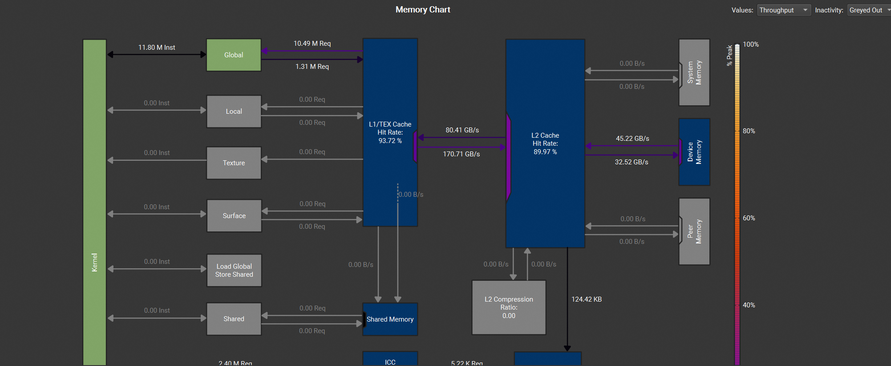

# benchmark
通用矩阵乘法(GEMM)的仓库，基于cutlass库实现
## quick-start

环境中3rd 包含cutlass   /home/LeetCUDA/third-party/cutlass/include
或使用本地下载好的cutlass库
要编译此项目，请在项目根目录下运行以下命令：

`nvcc -o gemm_simple ./gemm_simple.cu \`
`-arch=sm_86 \`
`-std=c++17 \`
`-I 3rd/cutlass/include \`
`--expt-relaxed-constexpr \`
`-cudart shared \`
`--cudadevrt none \`
`-lcublasLt \`
`-lcublas`

### 编译选项解释

* `-o gemm_simple`: 指定输出可执行文件的名称为 `gemm_simple`。
* `./gemm_simple.cu`: 指定源文件。
* `-arch=sm_86`: 指定目标 GPU 架构为 **Ampere** (`sm_86`)，这是 NVIDIA RTX 30 系列和 A10 所使用的架构。
* `-std=c++17`: 使用 C++17 标准进行编译。
* `-I 3rd/cutlass/include`: 添加 CUTLASS 头文件的搜索路径，确保编译器能找到库文件。
* `--expt-relaxed-constexpr`: 启用对 `constexpr` 的实验性宽松支持，这在某些 C++ 模板元编程场景下是必需的。
* `-cudart shared`: 链接到共享的 CUDA 运行时库。
* `--cudadevrt none`: 不链接到设备运行时库。
* `-lcublasLt`: 链接到 cuBLASLt 库，这是一个轻量级的 cuBLAS 库，专为高性能张量运算设计。
* `-lcublas`: 链接到 cuBLAS 库，用于矩阵乘法等基本线性代数操作。

---

## 运行

编译成功后，你可以直接运行生成的可执行文件：

`./gemm_simple`

这将执行 GEMM 运算并输出结果。

## gemm-simple
__A100__ ： gemm-simple 对比cublas实现：

gemm-simple中每次计算kTileK都需要将数据从`global mem` __copy__ 到 `register mem`中，因此内存带宽的利用率非常高，如下图所示：

