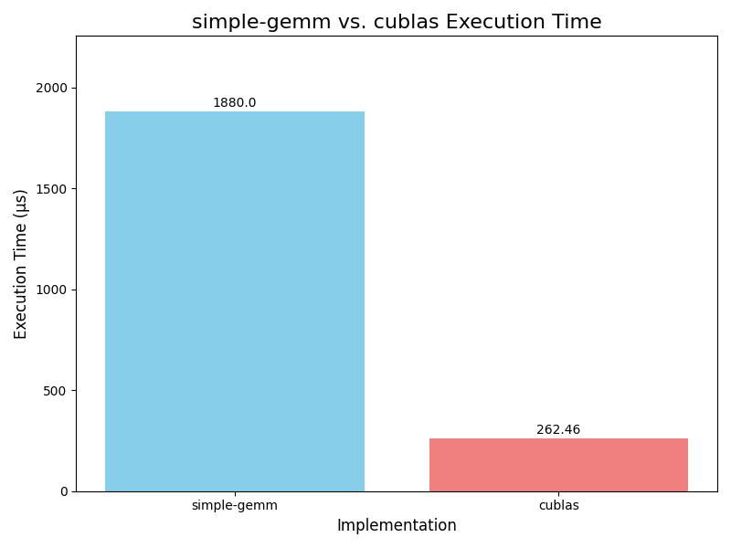
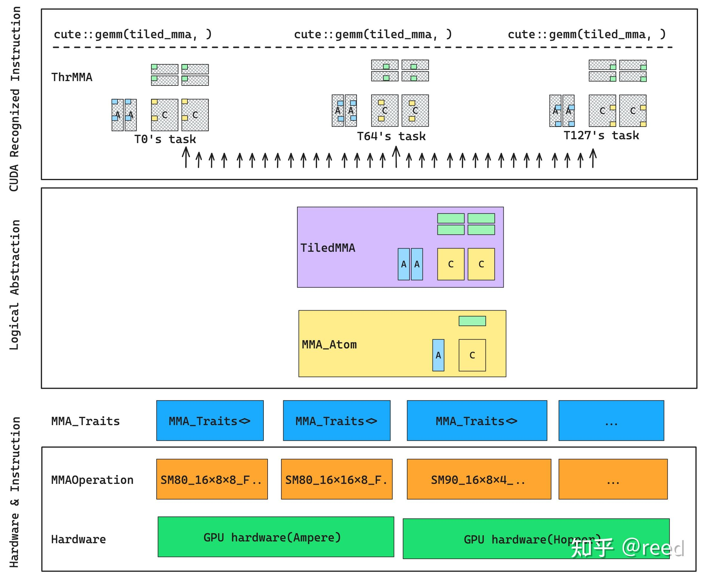
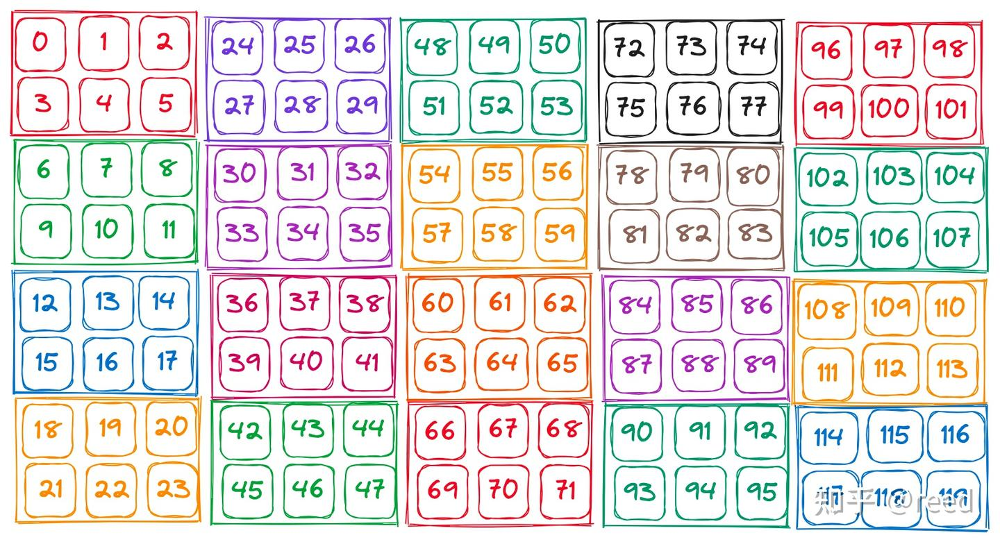
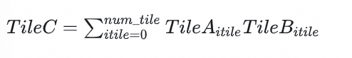
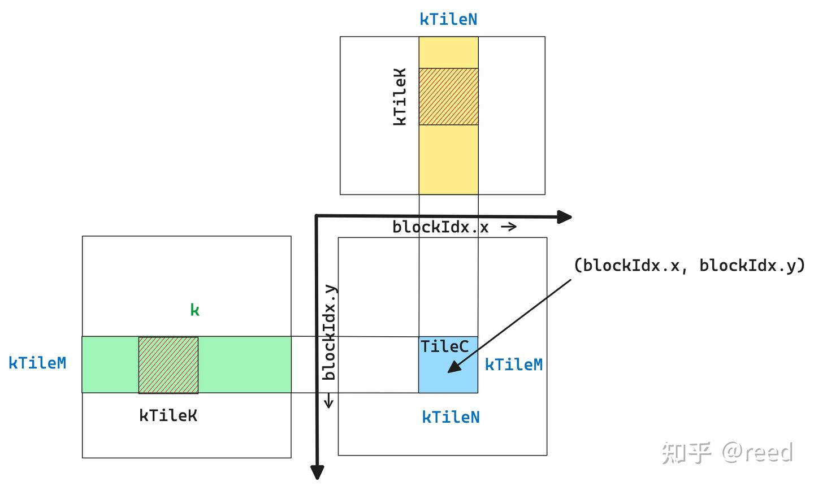
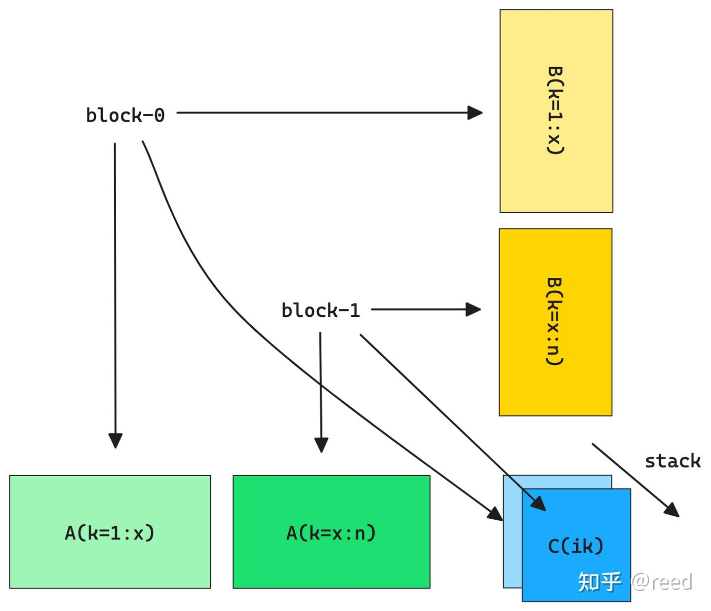
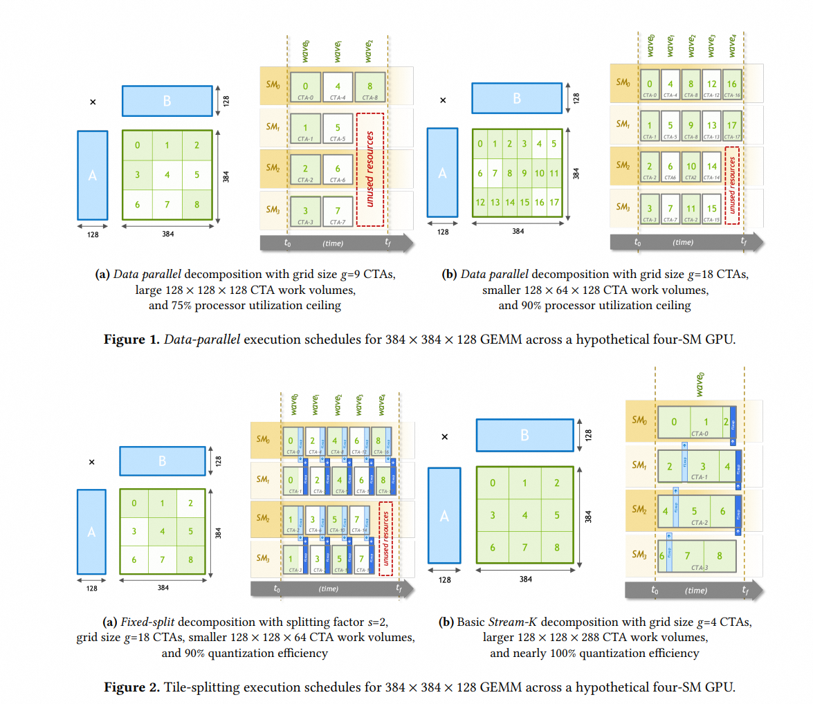

# benchmark
__A100__ ： gemm-simple 对比cublas实现：



# 前置知识
## Tensorcore
Tensorcore有两种方式可以进行调用
1. SDK： 矩阵计算库`cublas`和深度学习库`cudnn` 
2. CUDA：cuda提供的特定接口和`PTX`汇编。<br>
NVCC 提供了wmma(warp matrix multiply accumulate)和 mma(matrix multiply accumulate)两种形式
    * wmma: 提供fragment数据表示， 特定的`load_matrix_sync()`、`store_matrix_sync()`,`mma_sync()`数据加载和计算API来触发对Tensor Core的编程. 对数据和API进行了相应的抽象，编程简单，指令控制相对粗糙。
    * mma：数据直接面向寄存器表示，计算通过`mma.sync()`类的函数实现，细粒度高。
## cute
cute作为高性能的原语表示和抽象，基于`mma`实现，对数据和计算进行了很好的抽象的前提下，依然保留了精细控制能力。对于矩阵计算任务，cute提供了如下的抽象。
* __MMAOperation:__ MMA操作的抽象
    * 指令层的封装：代表实际的硬件MMA指令，针对不同的GPU架构，Nvidia提供不同的指令来调用TensorCore，封装了硬件指令同时提供了公共的`fma`方法，包含MMA的维度`shape(M,N,K)`, 输入输出的数据类型`(M,N,K,Accumulator)`
    ```c++
      using mma_op = SM80_16x8x16_F16F16F16F16_TN;
    ```
* __MMA_Traits:__ MMA操作的硬件特性
提供特定MMAOperation在硬件上的特性和限制。
    * __功能:__ 封装特定MMAOperation的**硬件细节** 
        * 寄存器文件大小：一个MMA操作需要多少寄存器来存储输入和输出
        * 线程粒度：一个MMA操作是由多少个线程共同完成的
        * 数据布局要求：输入矩阵A、B和输出矩阵C在寄存器文件中的期望布局
        * 支持的寻址模式：如何高效的从Global mem或者Shared mem中load data以满足MMA操作的布局需求  
    * __重要性:__ 连接抽象操作(`MMAOperation`) 和具体硬件(`Tensorcore`)的桥梁。
    ```c++ 
      using mma_traits = MMA_Traits<mma_op>;
    ```
* __MMA_Atom：__ 单个MMA指令的线程级(warp)操作
`MMA_Atom`描述了在单个**warp**内，如何将数据分布到各个线程的寄存器中，并执行一次或者多次`MMAOperation`。它是`cute`中最接近硬件指令级别的一个抽象
    * __功能:__ 定义一个warp如何参与一次或一系列原子性的MMA操作。指定每个线程负责的数据tile以及这些tile在寄存器中的组织方式
    * __细节:__ 包含数据在warp中如何分配，以及如何通过单个MMA指令组合这些数据的信息，一个`MMA_Atom`可能由多个`MMAOperation`组合而成
    * __重要性:__ `MMA_Atom` 是 cute 实现高性能的关键。它通过精确控制每个线程的数据访问和计算，最大化 Tensor Core 的利用率，并最小化线程间的同步和数据传输开销。它是 cute 实现精细控制能力的体现。
    ```c++
        using mma_atom = MMA_Atom<mma_traits>;
    ```
* __TiledMMA:__ Tile级别MMA操作
定义了如何将一个较大的矩阵乘法任务分解成一系列可以通过`MMA_Atom`执行的小块(瓦片)操作，并在整个线程块(thread block)内协调这些操作。
    * __功能:__ 描述一个线程块如何通过多步`MMA_Atom`操作来完成一个更大尺寸的矩阵乘法Tile。它处理了数据在Shared mem, register之间的移动，以及如何在CTA内部进行数据重排以满足`MMA_Atom`需求
    * __细节:__ 
        * 一个CTA应该负责计算的`C`矩阵块的逻辑尺寸(for example: 128 x 128)
        * 定义如何在K维度上进行迭代，每次迭代从global mem中load多少数据到shared mem
        * 是策略描述器，而不是具体的执行者，他不会告诉某个特定的threadIdx.x应该做什么

    * __Why Tile？__
        * 有些指令是Warp level的，但是code编写的都是线程级别的指令即`单线程`视角下的指令, 即便`__shfl_sync`等Warp级别操作，也是通过编译器和驱动层将这些线程级别的调用转化为底层的Warp级硬件指令
        * 因此在矩阵乘法问题上也需要将前面的逻辑的矩阵块分块，然后写出线程级别的代码 

* __ThrMMA:__ 线程组（或 Warp）级 MMA 操作（通常与 `TiledMMA` 结合使用）
定义了一个线程组(通常是一个Warp)如何参与到`TiledMMA`中，以及如何对数据进行拆分和重组，弥合`TiledMMA`这种高层次逻辑表达与底层线程级别代码实现之间鸿沟的桥梁。
    * __功能:__ 表示 `TiledMMA` 视图中单个线程组所承担的矩阵乘法子任务。它进一步细化了 `TiledMMA` 定义的Tile内的数据分布和操作。
    ```c++
        auto thr_mma = tiled_mma.get_slice(threadIdx.x);
    ```
    * __具体工作__ <br>
    ThrMMA 会根据：<br>
        1. TiledMMA 定义的整体策略。
        2. 调用它的当前线程的 threadIdx.x（以及隐含的，这个线程所在的Warp ID，它在Warp中的索引等）。
        3. 硬件特性（如Tensor Core的尺寸，Warp的大小）。<br>
        来精确地告诉这个特定线程：<br>
        * “在当前的计算阶段，你需要从全局内存的哪个具体地址加载数据？”（例如，通过 partition_A 或 partition_fragment_A 提供的视图）。
        * “你需要将加载的数据存储到你的哪些寄存器中？”
        * “你需要参与哪些MMA操作，并贡献哪一部分的乘法累加？”
        * “你负责计算C矩阵块中的哪几个具体的C元素？”


## layout
shape = ((2,4), (3,5)), stride = ((3,6), (1,24))

# 计算高效
### accumulator: 
在进行一系列数值运算(如加法、乘法操作)时，用来保存中间结果的变量和寄存器。常用于：
    * 累加多个值（矩阵乘法部分和）
    * 避免每次运算都写回内存，提高性能
    * 控制精度损失 </br>

GEMM 针对输入和Accumulator都为半精度类型的计算任务。ampere架构提供了Tensor Core上如下指令：
`mma.sync.aligned.m16n8k8.row.col.f16.f16.f16.f16` <br>
`mma.sync.aligned.m16n8k16.row.col.f16.f16.f16.f16`
CUTE 将这两条指令抽象成了MMA_Operation：
`SM80_16x8x8_F16F16F16F16_TN` <br>
`SM80_16x8x16_F16F16F16F16_TN`，

当输入较大的时候，就采用计算量更大的指令，来减少指令数目，提升调度效率

### 指定stride(k, Int<1>{}) 
    * 消除冗余计算: 避免执行实际的乘法或者加法运算来计算下一个内存地址，因为它知道地址只是简单的递增。
    * 更好的寄存器利用：连续的内存访问模式运行编译器将更多的数据加载到GPU register中。

### 以C矩阵为中心的任务划分策略
即一个`thread block`完成C矩阵中的一个小块(TileC)的计算任务。如下图所示：定义TileC大小为kTileM(行数目)、kTileN(列数目)，其相乘的矩阵为(kTileM, k), (kTileN, k), 在K轴上移动kTileK得到AB上的小块TileA_itile和TileB_itile，将他们相乘的积累加到TileC上，便可以得到TileC的计算结果，这种沿着k轴移动的策略称为`sliced-k`方法。



### block分块策略
* sliced-k: 先选定TileC， 沿着K轴移动小块进行累加求和。计算效率受制于m，如果m,n很小，则有一些SM会闲置，而有一些SM会循环计算多次
* split-k: 将k轴划分成多段，每段计算一个TileC结果，最后再通过额外的累加过程将多段的结果进行求和，这种模式的任务划分方法为split-k
* stream-k: 上面两种方法都是静态的划分任务，在划分的任务数目和SM执行单元不能整除的时候，总会存在某轮(wave)计算中存在SM空闲的问题，stream-k则是抛弃了以任务为中心的划分逻辑，而是变成了以计算资源为核心的分配任务方式，使得SM的任务量基本相当


## TiledMMA：主机端选择指令，设备端将分块划分到线程
前面经过把C++ pointer封装成tensor，然后利用`local_tile` 将tensor划分成小块，我们便可以得到一个thread block需要处理的任务。这时，假设我们通过前面MMA章节构造了一个TiledMMA能力，则借助其方法我们可以通过`ThrMMA`的partition_A/B/C方法实现对TileA、TileB、TileC的划分，通过`partition_fragment_A/B/C`便可以构造矩阵所需要的寄存器表示。

1. TiledMMA: 这是一个高层次的抽象，代表了一个分块矩阵乘法操作的上下文。它定义了如何将大的矩阵乘法问题分解成更小的、可由单个线程块或线程处理的子问题。
thr_mma = tiled_mma.get_slice(threadIdx.x): 每个线程（threadIdx.x）通过 get_slice 方法获取它在整个 TiledMMA 操作中负责的特定“切片”或“工作区”。这个 
2. thr_mma 对象包含了该线程进行MMA操作所需的所有配置信息，例如它应该加载哪个子块的数据、如何布局数据到寄存器中、以及如何进行累加。
3. gA, gB, gC: 这些通常代表存储在全局内存 (Global Memory) 中的原始大矩阵A、B、C。全局内存是GPU上最大、但访问速度最慢的内存。

* 函数调用: auto tArA = thr_mma.partition_fragment_A(gA(_, _, 0));
* 含义: partition_fragment_A 的作用是将全局内存中的某个特定“片段”（fragment）的数据映射到可以立即用于MMA操作的局部存储（通常是寄存器或快速共享内存）。
* 输入: gA(_, _, 0)
    * 这里的 gA(_, _, 0) 是一个重要的细节。它表示从 gA 中取出特定一个 K 瓦片索引的数据。在实际的循环中，这个 0 会被替换为当前的 k_tile_index。这意味着每次循环，我们都会从全局内存中选择一个新的 K 瓦片。
* 输出形状: (MMA, MMA_M, MMA_K) (注意，没有 num_tile_k)
    * 这表示 tArA 存储的是当前正在处理的、单个 (MMA_M, MMA_K) 大小的矩阵A片段的实际数据。这些数据通常已经被加载到线程的私有寄存器中，或者通过共享内存加载到寄存器中，等待立即参与MMA操作。
* 作用: tArA 是实际的数据容器。它包含了MMA操作当前步骤所需的精确数据。在矩阵乘法的 K 循环中，每次迭代都会调用 partition_fragment_A（或类似的加载操作），将新的 K 瓦片数据加载到 tArA 中，然后进行一次 mma_sync 操作。