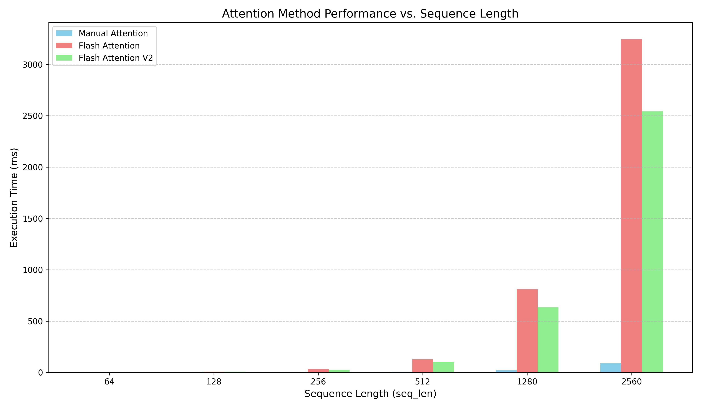

# flash attn v2 变动的地方
* flash attn v1以K、V为外循环，Q为内循环,将单个Q的output(**O**)分成Tr次进行计算，O_1, O_2 ...都和 Q_0 有关系。 这样每次在计算`new_O`的时候都需要从shared mem中重新加载`prev_O`。如果以Q为外循环，KV为内循环，这样就能避免从shared mem中读写中间结果
* softmax的操作也是在row维度上，即为每一个Query生成一个独立的、定制化的权重分布。 这也是为什么在softmax的时候需要指定维度为-1的原因，将Q固定循环KV，更天然符合softmax的特性。

# minimal_flash_attn
## 性能测试
### A10
在batch_size=16、head_num=16、head_dim=64不变的情况下，使用bench.py对不同seq_len的测试结果如下： 
 
| seq_len | manual_attention| flash_attention | flash_attention_v2 |
|---------|-----------------|----------------|--------------------|
| 64     | 0.083ms           | 1.194ms         | 1.703ms             |
| 128    | 0.292ms           | 8.895ms         | 6.562ms             |
| 256    | 1.005ms           | 32.739ms         | 25.782             |
| 512    | 3.681ms           | 127.939ms         | 102.313ms             |
| 1280    | 21.856ms           | 810.178ms         | 636.632ms             |
| 2560    | 89ms           | 3246.74ms         | 2543.349ms             |